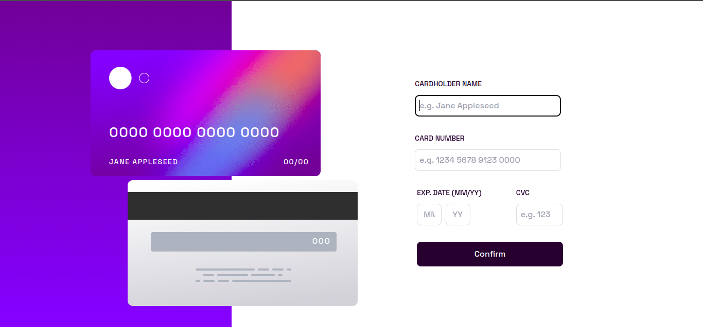

# Interactive Card Details Form

<div>
    
</div>


# Tecnologias

<ul>
    <li>ReactJS</li>
    <li>Talwind CSS</li>
    <li>JavaScript</li>
</ul>

# Como executar

Clone o projeto em seu dispositivo e acesse a pasta do mesmo.

```
$ git clone https://github.com/Lara123-pg/InteractiveCardDetailsForm-FrontendMentor.git
$ cd URLShorteningAPI-FrontendMentor
$ code .  (Abrir o Visual Studio Code)
```

Logo em seguida, o projeto estará em seu editor para ser executado.

# Projeto

Interactive Card Details Form é um desafio da plataforma FrontendMentor, que tem o objetivo de treinar os conceitos Frontend. E para que essa página fosse desenvolvida, foi utilizado ReactJS juntamente com o JavaScript e o Talwind CSS.

# Link do projeto hospedado

https://interactive-card-details-form-frontend-mentor.vercel.app/

# Autor

Lara Fernanda

Email: lamorimalvescavalcante@gmail.com

# Licença

Este projeto está sob a licença MIT - https://github.com/Lara123-pg/InteractiveCardDetailsForm-FrontendMentor/blob/main/LICENSE